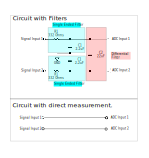

## 2. Hardware

### 2.1. Features

 - Microcontroller board Arduino UNO
    - Power supply via USB B (5V) or Power Plug (Power jack 2.1x5.5mm, 7-12V)
 - RTC with CR1220 backup battery
 - Data Storage
    - SD Card Slot
    - SD Card for data storage (Standard 16Gb)
 - _ON Led_ programmable, connected to Arduino pin 9
 - _RESET push button_ connected to Arduino reset pin
 - Analog Inputs
    - 4.3V as recommended maximum input
    - 5V as maximum input 
    - Noise Filters
        - Differential low pass filter for each differential channel
        - Single ended low pass filter for each single ended channel
        - Possible to disconnect each of them manually (the DL must be open)
     - Analog Digital Converters
        - 16 bits resolution (15 + 1 for sign)
        - Programmable gain range
        - Programmable sampling rate (8-860 SPS)

        - **_DataloggerArduino21_**
            - Inputs through 4mm banana plugs
            - 2xADC Board ADS1115
                - 4 differential (DIFF) or 8 single ended (CH) analog inputs
                - Board 1: DIFF1 and DIFF2 (or CH1-CH4) with I2C Address 0x48
                - Board 2: DIFF3 and DIFF4 (or CH5-CH8) with I2C Address 0x49
                
        - **_DataloggerGBE23_**
            - Inputs through screw connector
            - Overvoltage protection up to 15V
            - 3xADC Board ADS1115
                - 6 differential (DIFF) or 12 single ended (CH) analog inputs
                - Board 1: DIFF1 and DIFF2 (or CH1-CH4) with I2C Address 0x48
                - Board 2: DIFF3 and DIFF4 (or CH5-CH8) with I2C Address 0x49
                - Board 3: DIFF5 and DIFF6 (or CH9-CH12) with I2C Address 0x4A

 - Only **_DataloggerGBE23_**
     - _INFO Led_ programmable, connected to Arduino pin 8
     - 5x GPIO access (D1-D5 to arduino pins 3, 4, 5, 14 and 15)
     - 1mA constant current source
     - ~5V(Vcc) connectors
     - 3.3V connector
     - RELEASE SDCARD push button connected to Arduino reset pin 16

### 2.2. External Components / Interphase

<figure>
    
    <figcaption>Fig. 1: Arduino Datalogger 21 physical interface</figcaption>
</figure>

_________

<figure>
    
    <figcaption>Fig. 2: DataloggerGBE23 physical interface</figcaption>
</figure>

_________

#### 2.2.1 Front Side
##### 2.2.1.1. Analog inputs
**The standard  and default configuration is to use differential analog inputs with low pass filters.** This setup is recommended, because it gives the best results for DC signal measurements, which correspond to the output of multiple sensors. **For AC signal measurements, it is required to take differential measurements with the channel low pass filters deactivated (See 2.3.1 Passive RC Filters)**. Input conections require 4mm banana connectors for the **_DataloggerArduino21_** and simple wires for the **_DataloggerGBE23_**.

The analog inputs can be used as differential (DIFF) or as single ended (SE) channels of the ADS1115 ADC cards. The differential low pass filter in the ADC inputs is integrated in the ADC board, and can be manually (dis)connected.

Before taking measurements, special attention has to be given to requirements:
  - differential or single ended inputs?
  - low pass filtered input or direct input?
These requirements must be configured in both hardware and firmware:
  - (Dis)connect the required jumpers for the signal input filters (See Passive RC Filters).
  - Programme correctly the data acquisition firmware

###### Precautions

Analog inputs without reference to ground are called floating inputs. To assure good performance, we recommend to use a maximum differential voltage input of +/-4.3 V. 

If the voltage inputs are not floating, and are referred to ground, each of them must be kept within the analog input voltage limits:

minimum -0.3V, maximum 4.3V.

These voltages are defined for both DLs, they are below the ADS1115 board limits in order to assure good performance while using different power supplies. While the **_DataloggerGBE23_** have overvoltage protection up to 15V, the **_DataloggerArduino21_** is directly connected, and therefore more vulnerable. The 4.3V is set to keep a good resolution considering the use of low quality USB power supply, often provide only 4V. 

In summary:

> :warning: **WARNING** :boom:
>  - Analog Input Voltage Limits (if inputs are not floating):
>
>   Min = GND – 0.3V = -0.3V \
>   Max = VDD + 0.3V = 4.3V
>
>  - Differential Measurement Voltage Limits (if inputs are floating):
>
>   +/- 4.3 V
>
>  - Do not connect negative Voltages to GND.
>  - If available, connect the sensor shield to GND to reduce noise.
>  - In the PPRE labs, it is standard to do differential measurements. For this, connect the analog measurement inputs to the respective channel conectors.

##### 2.2.1.1.1 Differential Analog Inputs
The standard and recommended application of the DLs is to perform differential measurements. The DLs has up to four differential channels (See 1 in Figure 1), and the noise filter jumpers must be connected as required (See Passive RC Filters). Each Differential Channel has two measurement inputs, the first one is the High(H) and the second the Low(L) analog input.

DIFF1 and DIFF2 are connected to the ADC Board 1 with I2C address 0x48. 
DIFF3 and DIFF4 are connected to the ADC Board 2 with I2C address 0x49. 
(Only **_DataloggerGBE23_**) DIFF5 and DIFF6 are connected to the ADC Board 3 with I2C address 0x4A.

##### 2.2.1.1.2 Single Ended Analog Inputs
Although the standard and recommended application for the DLs is to perform differential measurements, single ended measurements can be taken. Each noise filter jumper must be connected as required (See Passive RC Filters). The DLs has up to eight (or twelve) single ended channels (See 2 in Figure 1). To take single ended measurements, the ground connector has to be used as reference for sensors with floating voltages. 
 
CH1 – CH4 are connected to the ADC Board 1 with I2C address 0x48. 
CH5 – CH8 are connected to the ADC Board 2 with I2C address 0x49. 
(Only **_DataloggerGBE23_**) CH9 – CH12 are connected to the ADC Board 3 with I2C address 0x4A.

##### 2.2.1.2 Ground Connectors
Ground connectors (See 3 in Figure 1) are mainly used in two different situations. First, for single ended measurements, a sensor with a floating voltage should be connect the ground. Second, for single ended or differential measurements, the Ground input can be used to connect the sensor shield (in case it is there). The sensor shield is the metal cover around a set of cables, used to reduce electrical noise.  **Do not connect analog inputs to ground while measuring differential voltages.**

##### 2.2.1.3 On and Info LEDs
The _On led_ (See 4 in Figure 1) is connected to the Arduino UNO pin 9. It is a digital I/O controlled by software, which is typically used to indicate operation details of the DL. 
(Only **_DataloggerGBE23_**) The _Info led_ (See 4 in Figure 2) is connected to the Arduino UNO pin 8. It is a digital I/O controlled by software, which is typically used to indicate operation details of the DL. 

##### 2.2.1.4 (Only **_DataloggerGBE23_**) Other inputs and outputs
 - 5x GPIO access. For details on each GPIO read the arduino UNO datasheet.
    - D1, D3 connected to arduino pin 3 and 5, with PWM output.
    - D2 connected to arduino pin 4
    - D4, D5 connected to arduino pin 14 and 15, which can also be used as ADC
 - 1mA constant current source with Vcc (~5V) as maximum voltage.
 - ~5V(Vcc) connectors with 270 Ohms resistor, limiting the output current to 18mA
 - 3.3V connector

### 2.2.2 Back Side
 - SD Card Slot and SD Card to stored measured values (See 5 in Figure 1)
 - USB connector, used to power the Arduino UNO and as serial communication port with a computer (See 6 in Figure 1)
 - (Optional) Power Supply plug (Power jack 2.1x5.5mm) to power the Arduino UNO with a voltage between 7-12V (See 7 in Figure 1)
 - Reset button to restart the Arduino UNO (See 8 in Figure 1)
 - (Only **_DataloggerGBE23_**) RELEASE SDCARD push button connected to Arduino pin 16.

## 2.3. Internal Components
The DLs are assembled utilizing modules with specific functionalities:

- 1x Arduino UNO (or equivalent) board, as the main microcontroller unit (See 1 in Figure 2)
- 1x XD204 Datalogging Shield with (See 2 in Figure 2).
    - a Real Time Clock (RTC) that keeps the time updated even when the device is disconnected,
    - a CR1220 backup battery for the RTC,
    - an SD slot to insert an SD Card.
    - a removable SD card to store the data, where final measurements are stored.
- 2x (or 3x) ADC boards with an ADS1115 integrated circuit, to perform the analog to digital conversion (See 3 in Figure 2). They have a resolution of 16 bits, a configurable input range and sampling rate. It is connected using the I2C protocol. In the _DataloggerArduino21_, the addresses can be selected by changing the jumpers below the ADCcard. The default addresses are: 
    - Board 1 (for DIFF1 and DIFF2) with I2C address 0x48. 
    - Board 2 (for DIFF3 and DIFF4) with I2C address 0x49. 
    - (Only **_DataloggerGBE23_**) Board 3 (for DIFF5 and DIFF6) with I2C address 0x4A.
- Passive RC Filters, to reduce electric noise in signals (See 4 in Figure 2). The filters can be (dis)connected manually by jumpers.
    - 8 (or 12) x single ended (one per single ended channel)
    - 4 (or 6) x differential (one per differential channel)
- (Only **_DataloggerGBE23_**) 1mA constant current source
- (Only **_DataloggerGBE23_**) Zenner diodes for overvoltage protection (+/- 15V)

> :warning: **WARNING**
>  The **_DataloggerArduino21_**) has an harware error in the filters disconnection.
> To have consistent and reliable results, it should only be used for DC measurements with filters.

<table>
<caption> Table 1. Datalogger Arduino 21 internal elements summary.</caption>

<tr>
<th>Element</th>
<th>Protocol</th>
<th>Function: Pin</th>
<th>Other</th>
<th>Num. in Figure 2</th>
</tr>

<tr>
<td>Arduino UNO</td>
<td></td>
<td></td>
<td></td>
<td>2</td>
</tr>

<tr>
<td>SD Card</td>
<td>SPI</td>
<td>CS: 10, MOSI: 11, MISO: 12, SCK: 13</td>
<td></td>
<td>1</td>
</tr>

<tr>
<td>RTC</td>
<td>I2C</td>
<td>SDA:18, SCL: 19</td>
<td>1</td>
<td></td>
</tr>

<tr>
<td>ADC Board 1</td>
<td>I2C</td>
<td>SDA:18, SCL: 19</td>
<td>Address: 0x48</td>
<td>3</td>
</tr>

<tr>
<td>ADC Board 2</td>
<td>I2C</td>
<td>SDA:18, SCL: 19</td>
<td>Address: 0x49</td>
<td>3</td>
</tr>

<tr>
<td>On LED</td>
<td>5V digital output</td>
<td>Info / On: 9</td>
<td></td>
<td>4</td>
</tr>

<tr>
<td>Passive RC Filters</td>
<td></td>
<td></td>
<td></td>
<td>4</td>
</tr>

<tr>
<td>ADC Board 3 (Only DataloggerGBE23)</td>
<td>I2C</td>
<td>SDA:18, SCL: 19</td>
<td>Address: 0x4A</td>
<td>3</td>
</tr>

<tr>
<td>Info LED (Only DataloggerGBE23)</td>
<td>5V digital output</td>
<td>Info: 8</td>
<td></td>
<td>4</td>
</tr>

<tr>
<td>5 GPIO (Only DataloggerGBE23)</td>
<td>See arduino UNO datasheet</td>
<td>D1-D5: GPIO 3,4,5,14,15</td>
<td></td>
<td>9</td>
</tr>

<tr>
<td>1mA constant output (Only DataloggerGBE23)</td>
<td></td>
<td>Constant current source</td>
<td>Vcc(~5V) max</td>
<td>10</td>
</tr>

<tr>
<td>Push Button ReleaseSDCARD (Only DataloggerGBE23)</td>
<td></td>
<td>Programable button</td>
<td>pin 16</td>
<td>11</td>
</tr>

</table>

<figure>
    
    <figcaption>Fig. 3: Datalogger Arduino2021 internal components</figcaption>
</figure>

_________

<figure>
    
    <figcaption>Fig. 4: DataloggerGBE23 internal components</figcaption>
</figure>

_________

### 2.3.1 Passive RC Filters
The passive noise filters are implemented to perform slow DC measurements under conditions with electrical noise. They can be connected or disconnected as required. For each case, see Figure 4 and Table 2.

<figure>
    
    <figcaption>Fig. 5. ADS1115 Address selection and Noise filters circuits details.</figcaption>
</figure>

_________

<table>
<caption> Table 2. Cases for (dis)connection of noise filters.</caption>

<tr>
<th>Type of measurement</th>
<th>Single Ended Filter</th>
<th>Differential Filter</th>
<th>Note</th>
</tr>

<tr>
<td>Single Ended DC</td>
<td>Optionally connected</td>
<td>Disconnected</td>
<td>Both inputs from a differential channel must be used as single ended</td>
</tr>

<tr>
<td>Differential DC</td>
<td>Optionally connected</td>
<td>Optionally connected</td>
<td>**The standard use case is to keep them connected.**</td>
</tr>

<tr>
<td>Differential AC</td>
<td>Disconnected</td>
<td>Disconnected</td>
<td></td>
</tr>

</table>

#### Specifications
For full specification details, read the datasheet of each component.

### 2.3.2 Constant Current Source
The integrated 1mA constant current source can deliver up to 2V. The voltage delivered depends on the load connected to its terminals, and can be used to power sensors, e.g. PT100 or Pt1000.

To callibrate it, connect to its terminals a circuit with a load between 100-1900 Ohms in series with an amperimeter. Measure the current generated and adjust the blue knob until reaching 1mA.

### 2.3.3 Operation Ratings

Operating Temperature
 - From Arduino UNO specifications: -40 °C (-40°F) 85 °C ( 185°F)

Voltage supply Arduino
 - USB B: Maximum 5.5V
 - Power jack 2.1x5.5mm: 6V – 12V (possible until 20V but not recommended, might fail depending on load demand and ambient temperature.)

Analog Voltage input
 - Min = GND – 0.3V = -0.3V
 - Max = VDD + 0.3V = 4.3V
 - Differential input limits (H-L) = +/- 4.3V

> This values are given to limit measurements under reliable conditions. USB power supplies output varies from 4-5.5 V, even when the nominal value is 5V. ADS1115 inputs range (h-l) is +/- VDD + 0.3V). Therefore, 4V are considered as default VDD.

<figure>
    
    <figcaption>Fig. 6. Arduino UNO pinout. Source:https://github.com/Bouni/Arduino-Pinout.</figcaption>
</figure>

_________

