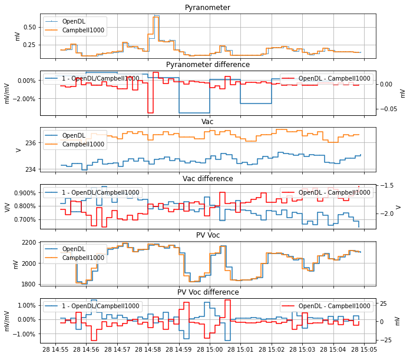

## 5. Validation

A validation process is being done in order to assess the measurements reliability of the DataloggerGBE23. It will be done comparing measurement results of the OpenREDatalogger with a professional Datalogger Campbell 1000.
This section presents and initial comparisson of measurements taken with different sensors and ranges.
The measurements were taken with 10 seconds sampling interval and three different sensors:
- A small solar panel (PV) in the 2.560V range
- A Pyranometer in the 0.256V range
- A transformer to measure AC Grid voltage 0.256V, with a multiplication factor of 0.692 V/mV

Both dataloggers had different internal clock time, therefore the following corrections were done on the DataloggerGBE23 data: a 10 seconds time shift and a resampling to match the sampling times.
As an initial and rough view, Fig 1 present the results of four days measurements. To see details on the same measurements, Fig 2 presents a twenty minutes sample.

Both figures present 2 plots per sensor, the first one has the measurements of each datalogger and the second the difference. The blue line (in the left axis) presents the relative difference, calculated by the equation: 1 - OpenDL / Campbell1000. The red line (in the right axis) presents the absolute difference, calculated by the equation: OpenDL / Campbell1000.

The absolute errors are in general below 1%. Exception are moments in which the raw voltage measured are really low (below 0.1 mV) or when the signal change really fast (each DL have different sampling methods)
These details can mainly be seen in Fig 2.

As an inital conclusion, we can say that the measurements have a high reliability and can be used for applications in which this uncertainties are aceptable. 

<figure>
    
    <figcaption>Fig. 1: 4 days measurements samples with DataloggerGBE23 and Campbell CR1000.</figcaption>
</figure>

_________

<figure>
    
    <figcaption>Fig. 2: 20 min measurements samples with DataloggerGBE23 and Campbell CR1000.</figcaption>
</figure>

_________

